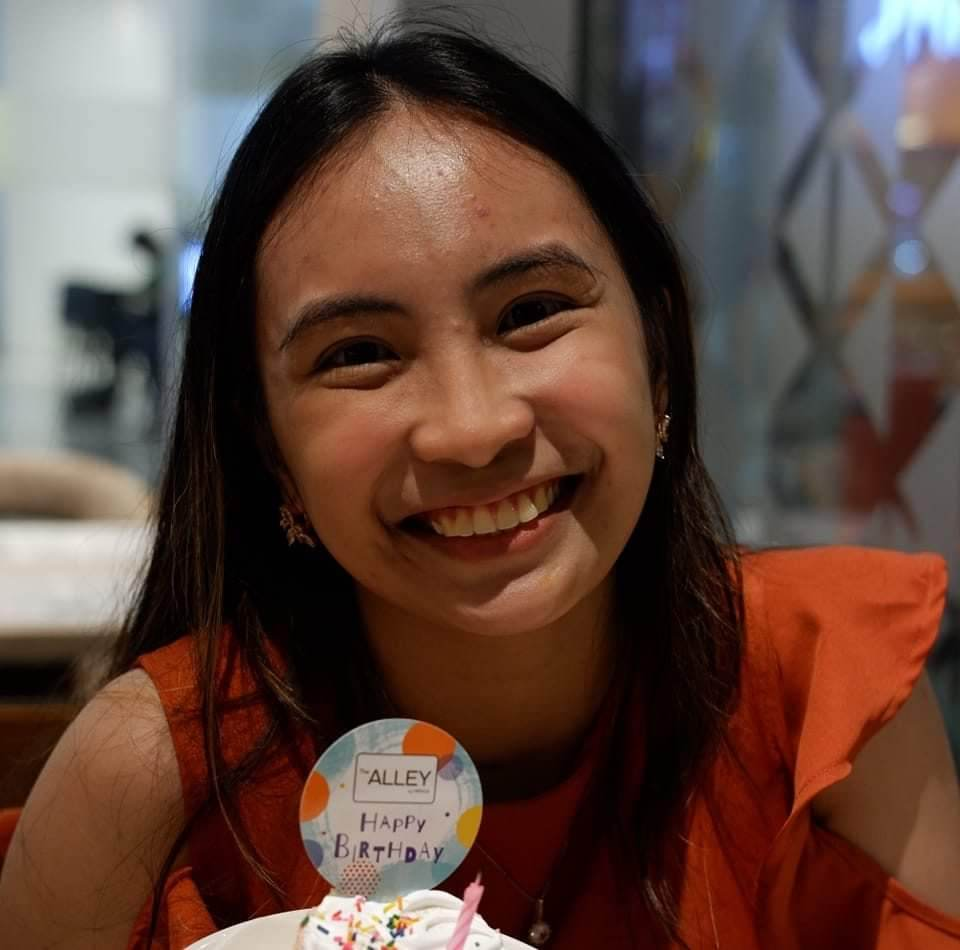
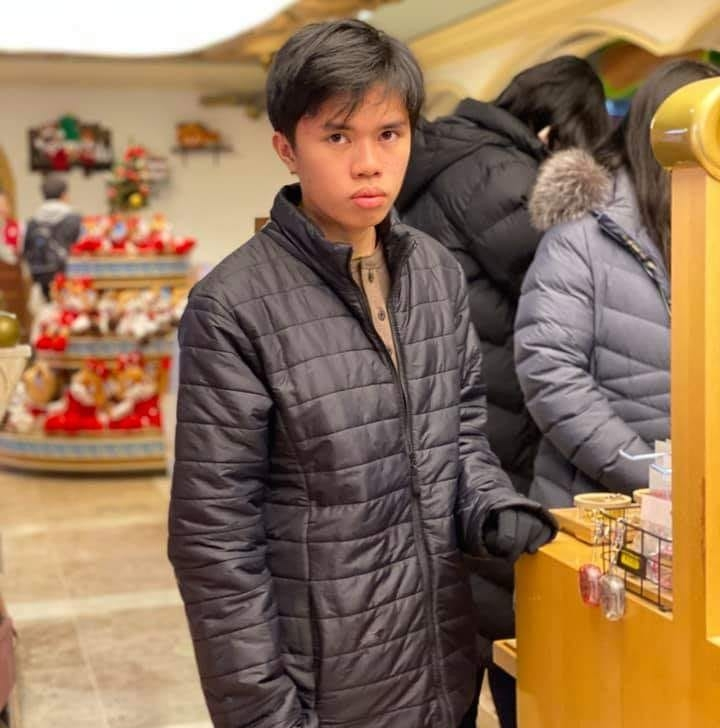

# The Team

Equipped with knowledge about data science and machine learning, we, a group of data science students from the University of the Philippines - Diliman, seek to understand how mis/disinformation spread in social media platforms like Twitter.

## Hans Gabriel De Castro

A 4th year BS Computer Science student at UP Diliman. He has experience in teaching Python to kids and teens. But as a hobby, he modifies his Android devices at usually the root level to obtain better performance and battery life. He is also very passionate in fighting for human rights and social justice.
## Jemimah Mae Isaig

A 3rd year BS Computer Science student at UP Diliman. She shows interest in electronics and software engineering. She enjoys singing and playing musical instruments as a hobby.
## Gabriel Kenneth Mariñas

A 4th year BS Computer Science student at UP Diliman. He has a penchant for building simple programs that pique his interest. He enjoys watching movies and shows, taking leisurely walks with his dog, and learning new languages.