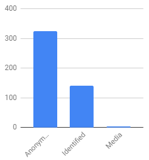
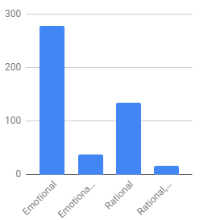
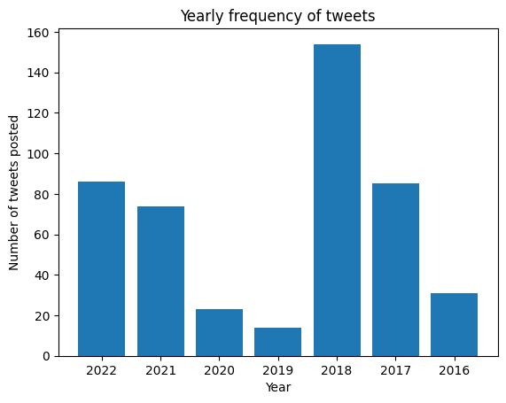

## Data Description

The data used in this study is a collection of tweets scraped from Twitter using an open-source scraper called [Scweet](https://github.com/Altimis/Scweet). We have modified the scraper based on our needs and its repository can be accessed [here](https://github.com/marshblocker/cs132-scraper). All of the collected tweets have one thing in common: they share misinformation/disinformation in Twitter by claiming that Leni Robredo have cheated during the 2016 General Election. We want to explore our dataset in a manner that proves the hypothesis we have established in the Overview section.

### Prerequisites

Before we can start exploring our dataset using _Python_, we need to import some libraries that will aid us in the exploration and some functions for uniform logging:

```python

# Import useful libraries
import numpy as np                  # For matrix computation
import pandas as pd                 # For manipulating tabular data
import matplotlib.pyplot as plt     # For plotting
from pprint import PrettyPrinter    # For pretty printing

PP = PrettyPrinter(indent=4)

def log(key: str, val: object):
    print('=============================================')
    print('{}: {}'.format(key, val))

def pretty_log(key: str, val: object):
    print('=============================================')
    print('{}:'.format(key))
    PP.pprint(val)
 
```
We also need a function for getting the dataset online (which is currently stored in _Google Sheets_) and storing it as a `pandas.DataFrame`:

```python

# URL of the Google Sheets instance where the data is currently stored.
SHEETS_URL = 'https://docs.google.com/spreadsheets/d/13po7PpREeyEyJ6lV4JXhDYYBud8lsO2djxssOquiNYk/export?gid=928081655&format=csv'

def get_dataframe() -> pd.DataFrame:
    df = pd.read_csv(SHEETS_URL)

    return df
 
```

### First glimpse of the dataset

We can now proceed. First, we store the dataset to `df`:

```python

df = get_dataframe()
 
```

To get a glimpse of what the dataset looks like, we print the first entry in the dataframe:

```python

pretty_log('First entry', df.iloc[0])
 
```
_Output:_
```txt

=============================================
First entry:
ID 31-1
Timestamp 03/31/2023 16:43:12
Tweet URL https://twitter.com/VincegDelgado/status/95122...
Group 31
Collector De Castro, Hans Gabriel
Category RBRD
Topic Leni cheated during the 2016 General Election
Keywords fakevp, mandaraya, 2016, leni, cheater, vp, ro...
Account handle @VincegDelgado
Account name Bee Scent Tea
Account bio A father, a Mentor, a Student, and I make change!
Account type Identified
Joined 06/23
Following 405
Followers 7
Location The Global City, Taguig
Tweet correct! y shud he? he is our genuine VP not t...
Tweet Translated NaN
Tweet Type Text, Reply
Date posted 01/10/2018 22:37:38
Screenshot NaN
Content type Rational
Likes 1.0
Replies 0.0
Retweets 1.0
Quote Tweets 0.0
Views NaN
Rating NaN
Reasoning The tweet is a mis/disinformation since PET ju...
Remarks NaN
Tweet ID 951221523662057473
Reviewer NaN
Review NaN
Name: 0, dtype: object
 
```
That's a lot of features! Later on, we will process our dataset to remove some features that we do not need. But for now, we will answer some basic questions about our dataset.

### How many tweets are in the dataset?

Let's count the total entries in the dataframe to get the total number of tweets we
have collected:
```python

log('Total number of collected tweets', len(df))
 
```
_Output:_
```txt

=============================================
Total number of collected tweets: 468
 
```
We have collected 468 tweets.

### What are the features of the dataset?

Let's get the shape of the dataset and print the number of columns it has:

```python

log('Total number of features of the dataset', df.shape[1])
 
```
_Output:_
```txt

=============================================
Total number of features of the dataset: 33
 
```
Our dataset have 33 total features. Let us provide a brief description of each feature:

| Feature | Data Type | Description |
| ------- | --------- | ----------- |
| ID | `str` | Unique identifier to the data entry |
| Timestamp | `str` | When the data entry was included in the dataset |
| Tweet URL | `str` | URL that directs to the tweet associated to the data entry |
| Group | `int` | Our group number |
| Collector | `str` | Name of the group member who collected the data entry |
| Category | `str` | Which category the project belongs to, e.g. Robredo, Martial Law, etc. |
| Topic | `str` | Specific topic related to the category of the project |          
| Keywords | `str` | Set of words used to find the associated tweet |
| Account handle | `str` | Unique identifier to the user who posted the tweet. Begins with @. |
| Account name | `str` | Display name of the user. Not necessarily unique. |    
| Account bio | `str` | Biography of the user. |  
| Account type | `str` | Accounts are categorized based on their authenticity. Can be 'Anonymous', 'Identified', or 'Media'. |
| Joined | `str` | The exact month and year the user joined Twitter. |         
| Following | `int` | How many users the user follows. |       
| Followers | `int` | How many users follow the user. |
| Location | `str` | Location of the user. |        
| Tweet | `str` | The text content of the associated tweet. |           
| Tweet Translated | `str` | English translation of the tweet. Optional. |
| Tweet Type | `str` | The mediums and forms used to post the tweet. Can be 'Text', 'Image', 'Video', 'URL', and/or 'Reply'. |      
| Date posted | `str` | The exact date the tweet was posted. | 
| Screenshot | `str` | Screenshot of the Twitter page where the tweet can be found. Optional. |
| Content type | `str` | How the tweet is written. Can be 'Rational', 'Emotional', 'Transactional', or a combination of the three. |    
| Likes | `int` | Number of likes the tweet has received. |           
| Replies | `int` | Number of replies the tweet has received. |
| Retweets | `int` | Number of retweets the tweet has received. |        
| Quote Tweets | `int` | Number of quote tweets the tweet has received. Optional. |    
| Views | `int` | Number of views the tweet has received. Optional. |
| Rating | `str` | How we rate the veracity of the tweet. Optional. |          
| Reasoning | `str` | Provided reason on how the tweet contains misinformation/disinformation. |
| Remarks | `str` | Additional comments regarding the data entry. |
| Tweet ID | `str` | Unique identifier to the tweet. Optional. |       
| Reviewer | `str` | Name of the data entry reviewer. |       
| Review | `str` | The evaluation of the reviewer. |

`Tweet ID` is the only feature that is not included in the initial set of features
specified by the project requirements. We included it to remove duplicate tweets
in the dataset. We generated the `Tweet ID` column using the following Excel function (where `2` in `C2` can change based on the row of the data entry):

```txt

MID(C2,FIND("/status/",C2)+8,50)
 
```
The function extracts the right substring of the rightmost `/` separator in the `Tweet URL` feature which represents the id of the tweet. For example, the tweet url `https://twitter.com/foo/status/123456` yields `123456` as its tweet id.

We do not need all the features listed above, so we first need to preprocess the data before we can begin with data exploration.

## Data Preprocessing

Now that we have seen the basic description of our dataset, we preprocess the dataset so that it caters to the specific needs of our problem. When we contextualize our dataset, there might be instances where we will have to add or remove features. We must also decide on what to do if we have missing values in our dataset.

### Are there any unnecessary features in the dataset that need to be removed?
From our Action Plan, we have two main tasks. The first is to get the posting date of the tweets that accuse Leni Robredo of cheating in the 2016 Philippine General Elections. Remember that the `Date posted` feature was already previously discussed. This means that this is one of the features that we will definitely keep. Meanwhile, our second task is to analyze the frequency of the tweets per date. For this, we will no longer need the following features: `ID`, `Timestamp`, `Group`, `Collector`, `Keywords`, `Account name`, `Account bio`, `Screenshot`,`Category`, `Topic`, `Following`, `Followers`, `Tweet`, `Tweet Translated`,  `Likes`, `Replies`, `Retweets`, `Quote Tweets`, `Views`, `Rating`, `Reasoning`, `Remarks`, `Reviewer`, and `Review`. Here we drop the unnecessary features mentioned earlier and print the remaining features:

```python

# Drop unecessary columns
df = df.drop([
        'ID', 'Timestamp', 'Group', 'Collector', 'Keywords', 
        'Account name', 'Account bio', 'Screenshot','Category', 
        'Topic', 'Following', 'Followers', 'Tweet', 'Tweet Translated', 
        'Likes', 'Replies', 'Retweets', 'Quote Tweets', 'Views', 
        'Rating', 'Reasoning', 'Remarks', 'Reviewer', 'Review'
    ],
    axis = 1
)
pretty_log('Remaining columns', list(df.columns))
 
```
_Output:_
```txt

=============================================
Remaining columns:
[   'Tweet URL',
    'Account handle',
    'Account type',
    'Joined',
    'Location',
    'Tweet Type',
    'Date posted',
    'Content type',
    'Tweet ID']
 
```

We need the `Date posted` column to include the tweet in the frequency count per day and the `Tweet ID` to ensure that this tweet is unique. We also retain the `Account handle`, `Account type`, `Joined`, `Location`, `Tweet Type`, and `Content type` feature for additional exploration.

### Are there any missing values in the dataset?
Now that we have eliminated the unnecessary features in our dataset, we can now proceed to check if our relevant features have missing values. This is to prevent errors when processing our data. To do this, we use panda's `isna()` method.

```python

# Check for missing values
pretty_log('Number of missing values per feature', df.isna().sum())
 
```
_Output:_
```txt

=============================================
Number of missing values per feature:
Tweet URL           0
Account handle      0
Account type        0
Joined              0
Location          209
Tweet Type          0
Date posted         0
Content type        0
Tweet ID            0
dtype: int64
 
```
We can see that there are 209 missing entries for Location. This is understandable because not all twitter users put their location in their profile. To alleviate this, we are going to use panda's `fillna` method to fill in the null values with an empty string.

```python

df['Location'] = df['Location'].fillna('')
pretty_log('Number of missing values per feature', df.isna().sum())
 
```
_Output:_
```txt

=============================================
Number of missing values per feature:
Tweet URL         0
Account handle    0
Account type      0
Joined            0
Location          0
Tweet Type        0
Date posted       0
Content type      0
Tweet ID          0
dtype: int64
 
```
We have completely handled missing values in the dataset.

### Are there any columns in the dataset that need to be processed to simplify the data exploration process?
Because of the particular format of the `Date posted` column, Python’s pandas module interprets the values in this column as a string and not as a `datetime` object. This is problematic because we want to easily extract specific parts of our date like the year, month, and date. We can also easily perform operations like subtraction to get the elapsed time between two given date and timestamp. To accomplish this, we had to process the `Date posted` column in Python. We use `pd.to_datetime()` to convert the timestamp string to `pd.Timestamp` and `dt.date` to trim out the time portion of the timestamp:

```python

df['Date posted'] = pd.to_datetime(
        df['Date posted'], 
        format = "%d/%m/%Y %H:%M:%S"
    ).dt.date

pretty_log('Date posted values', df.head()['Date posted'])
 
```
_Output:_
```txt

=============================================
Date posted values:
0    2018-01-10
1    2018-01-19
2    2018-01-21
3    2018-01-22
4    2018-01-22
Name: Date posted, dtype: object
 
```
With this, we have binned the `Date posted` feature by date which originally has a by-second interval.

Let us again get a glimpse of the dataset to see the differences made by the preprocess step:

```python

pretty_log('First entry of the dataset', df.iloc[0])
 
```
_Output:_
```txt

=============================================
First entry of the dataset:
Tweet URL         https://twitter.com/VincegDelgado/status/95122...
Account handle                                       @VincegDelgado
Account type                                             Identified
Joined                                                        06/23
Location                                    The Global City, Taguig
Tweet Type                                              Text, Reply
Date posted                                              2018-01-10
Content type                                               Rational
Tweet ID                                         951221523662057473
Name: 0, dtype: object
 
```
This is enough to proceed with data exploration.

## Data Exploration

Before we can proceed with the exploration, we must have a clear understanding of the characteristics of our features. Hence, we must know the distribution of our features.

### Features Distribution

Besides the distribution of the number of tweets per date (which is the main focus of our exploration), we want to know the distribution of our other features, specifically the `Account type` feature and the `Content type` feature.

1. Account Type Distribution


As we can see, majority of the users who posted misinformation/disinformation regarding the topic are anonymous. If we consider the fact that most trolls who post misinformation/disinformation have concealed identity, then this distribution supports that fact.

2. Content Type


Note that the second bar represents 'Emotional, Rational' and the fourth bar represents 'Rational, Emotional' which means they are the same. We can observe that majority of the tweets are emotional and almost half of them are rational. If the users aim to spread misinformation/disinformation, then it makes sense that most of them will appeal to the emotions of the readers rather than their rationality since the barrier of persuasion is lower in most cases.

### What is the time range of the tweets in the dataset?
Since this project employs time series analysis, we do not just focus on the characteristics of the tweet itself. We primarily analyze the time in which the tweet was posted. But since this topic existed at a particular point in Philippine history, we must limit the scope of the tweets that we will include in our data set.

The time range of the tweets in the dataset is between May 2016 and December 2022. We obtained this through sorting the data by ‘Date posted’ and identifying the topmost (least recent) and bottommost (most recent) tweet in our sorted dataset.

```python

# sort the dataframe by the datetime column in ascending order
df = df.sort_values(by='Date posted', ascending=True)

# select the least recent time by selecting the first row
least_recent_time = df.iloc[0]['Date posted']

# sort the dataframe by the datetime column in descending order
df = df.sort_values(by='Date posted', ascending=False)

# select the most recent time by selecting the first row
most_recent_time = df.iloc[0]['Date posted']

log("First tweet", least_recent_time)
log("Last Tweet", most_recent_time)
 
```
_Output:_
```txt

=============================================
First tweet: 2016-05-11
=============================================
Last Tweet: 2022-12-13
 
```

### What is the distribution of tweets over time?

After determining the scope of the date of our tweets, we can now begin to contextualize our tweets. By checking the freequency of tweets per day in our range, we can identify which months or time range are of particular importance to us. But even if a time range does not have a lot of tweets, then it still provides insights because it is telling us another story that we can rationalize by cross-checking our data with the timeline of this topic.

```python

tweets_freq = df['Date posted'].value_counts()
tweets_freq.plot(title = "Frequency of tweets per day")
 
```
_Output:_


Below are some observations from our plot above: 

1.   During 2016 to early 2017, the tweets posted ranges from 3-5 tweets per day. We can also notice that there were some months during 2016 when there is only 1 tweet posted per day.

2.   Notice how the number of tweets spiked during late 2017 with 2-9 tweets posted per day and late 2018 with 2-8 tweets per day. These are the years when there were a lot of tweets posted regarding our chosen topic.
3.   In the years 2019 to 2021, there are only 1-2 tweets posted.
4.   During late 2021 until mid 2022, we can observe that there is a pattern here. There were 2 tweets posted almost everyday until there was a sudden spike in mid 2022 which continued before the start of 2023.

### Yearly frequency of tweets

Previously, we checked the frequency of tweets per day. But the impact of real world events do not just affect people during that day. It creates a ripple through time. Hence, it becomes important for us to group certain dates so that we can create more insightful analysis. Hence, we check the yearly frequency of our dataset so that we can see how this topic grew as the careers of both Leni and Marcos progressed.

```python

yearly_data = dict()
for index, row in df.iterrows():
    # print(row['Date posted'].year)
    yr = row['Date posted'].year
    if yr not in yearly_data:
        yearly_data[yr] = 1
    else:
        yearly_data[yr] += 1

plt.bar(range(len(yearly_data)), yearly_data.values(), tick_label=list(yearly_data.keys()))
plt.xlabel('Year')
plt.ylabel('Number of tweets posted')
plt.title("Yearly frequency of tweets")
plt.show()
 
```
_Output:_



From the graph above, we can see that the year 2018 saw the highest number of tweets claiming that Leni Robredo cheated in the 2016 elections. This may come out as surprising because it has been 2 years already since Marcos first filed an electoral protest against Robredo's win. And it is also 4 years ahead of the 2022 Philippine National Elections where anti-Leni forces reiterated the narrative that Leni cheated in the 2016 election.

### Are there any outliers in the time series data?

Because we are handling a sensitive topic - misinformation, we cannot afford to have faulty interpretations of our data. Creating interpretations without pointing out the existence of outliers in our dataset can provide more harm than good in this age when troll farms intentionally spew out lies in order to shape the political climate.

The sudden spike of the number of tweets during 2017 and 2018 is considered outliers in our time series data since it is not connected in our hypothesis. We do not know what caused this sudden spike.

### Are there any significant events or changes in the time series data (e.g. sudden drops or spikes)?

Now that we have identified the outliers in our data, we can now carefully identify the topic's relevant events and cross-examine them with our data.

From our observation, 2018 was the year when there were a lot of tweets accusing Leni of cheating in the 2016 General election. However, notice that there was a sudden drop on the number of tweets during the years 2019 until 2021. Then, there was a noticeable pattern during 2022 and the number of tweets suddenly spiked mid- and late 2022.

### Is there a relationship between the time series data and any external variables?

Still in relation with identifying the events that reflects our time series data, we now try to figure out what were the material conditions that gave birth to the data that we currently have. With this, we can provide better insights that can be used by future researchers as well when expanding this study.

Note that Leni Robredo filed her Certificate of Candidacy for Presidency last October 7, 2022. As can be seen from our plot, there was a sudden spike during late 2022. Hence, this event might have led to sudden changes in our time series data.