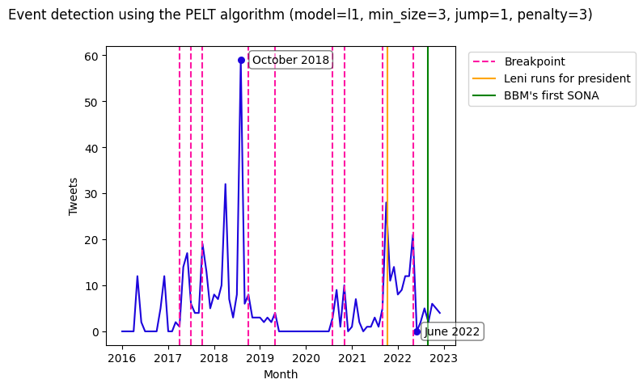

## Data modeling

The graphs show the result of applying  the Linearly penalized segmentation algorithm [1] (PELT) to a time-series data that records the number of misinformation/disinformation tweets about our chosen topic from the beginning of year 2016 to the end of year 2022.  We have tested different parameters for the algorithm and this is the configuration that best approximates the start and end period of our hypothesis. Unfortunately, the algorithm can only predict the start period of the hypothesis and not the end period of the hypothesis. Hence, we reject our hypothesis.

We note that the algorithm is able to detect the last lowest peak of the time-series data (June 2022) which is the month when BBM took his oath of office as 17th president of the Philippines. Hence, it is possible that we have made a mistake in choosing the end period of our hypothesis. Additionally, we observe that the highest peak occurred in October 2018 and the relevant event during that month is when BBM requests the inhibition of Associate Justice Caguioa in BBM's poll protest case [3].

## References
[1] Killick, R., Fearnhead, P., & Eckley, I. (2012). Optimal detection of changepoints with a linear computational cost. Journal of the American Statistical Association, 107(500), 1590–1598.

[2] “Fact-check: 2016 vice presidency was not ‘stolen’ from Marcos,” #PressOnePH, https://pressone.ph/fact-check-2016-vice-presidency-was-not-stolen-from-marcos/ (accessed Jun. 7, 2023).

[3]“Marcos Seeks Inhibition of Associate Justice Caguioa in Poll Protest Case.” Cnn, 6 Aug. 2018, www.cnnphilippines.com/news/2018/08/06/Marcos-wants-Associate-Justice-Caguioa-out-election-case.html.